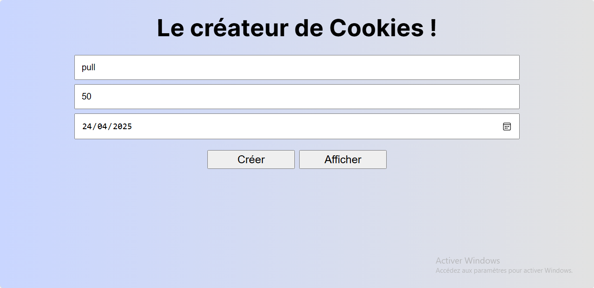

# 🍪 Cookie Generator App

A simple JavaScript application that allows users to create, display, and delete cookies using a custom form input.

## ✨ Features

- ➕ Create cookies with custom **name**, **value**, and **expiration date**
- 👀 Display existing cookies in a clean format
- ❌ Delete cookies individually

## 🛠️ Tech Stack

- HTML  
- CSS  
- JavaScript (Vanilla)

## 🚀 Getting Started

## 🎓 Learning Source
This project was built while following a course on Udemy as part of a training to practice handling cookies in JavaScript.

## 📸 Preview

## 👩‍💻 Author

### Grace Ariane
Passionate JavaScript developer exploring frontend and backend magic ⚡
- linkedIn - [Grace Ariane Tchoukeu](https://www.linkedin.com/in/grace-ariane-tchoukeu)

**This project was created for learning purposes. Feedback and suggestions are welcome 💡**
